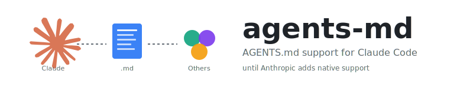

<p align="center">
  
</p>

<p align="center">
  <code>claude plugin marketplace add andrewgazelka/claude-autoread && claude plugin install autoread</code>
</p>

Claude Code plugin that auto-injects context files into your session. Configurable via simple text files.

## Config

Create `~/.config/autoread` with one filename per line:

```
AGENTS.md
CONTRIBUTING.md
```

Override per-repo with `.autoread` or `autoread` in any directory.

## How It Works

1. **SessionStart**: Walks up from cwd, injects all matching files
2. **Read hook**: Discovers new context files as Claude reads files in different directories
3. **Per-session state**: Same file won't be injected twice

## Defaults

If no config exists, defaults to:
- `AGENTS.md`
- `CONTRIBUTING.md`

## Requirements

[Bun](https://bun.sh) must be installed.

---

<details>
<summary>Why not just symlink?</summary>

You can `ln -s AGENTS.md CLAUDE.md`, but:
- Pollutes repos with Claude-specific files
- Doesn't auto-discover files in subdirectories
- This plugin works transparently

</details>
